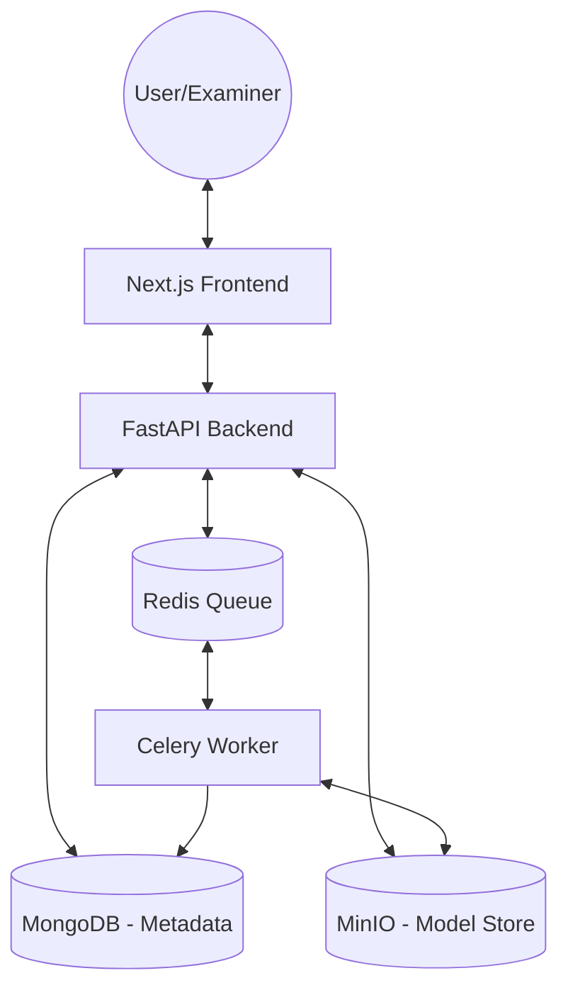
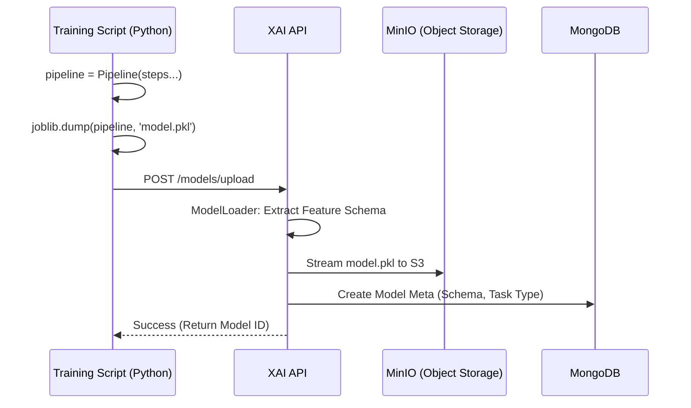
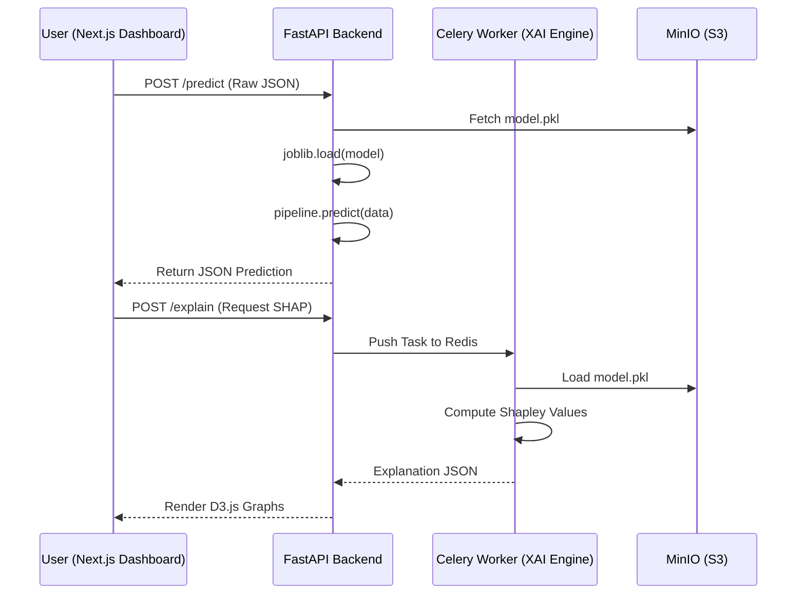

# 🗺️ XAI Platform: Technical Architecture Diagrams

These diagrams explain the "How it Works" visually. You can describe these during your viva to show you understand the full stack.

---

## 1. System Component Hierarchy
This diagram shows how the platform handles high-performance tasks and storage.



---

## 2. The Model Life Cycle (Training to Upload)
Explain this flow to show how a script becomes an active model on the dashboard.



---

## 3. The Prediction & Explanation Request Flow
This is the most critical flow to explain during a Viva.



---

## 4. Feature Space vs. Raw Space
Explain how the platform bridges the gap between raw user input and model tensors.

```mermaid
flowchart LR
    Raw[Raw Input: "Married: Yes"] --> PE[Pipeline: FeatureEngineer]
    PE --> Enc[One-Hot Encoding: [1, 0]]
    Enc --> Scale[StandardScaler: 0.85]
    Scale --> Pred[XGBoost Prediction]
    Pred --> Inverse[XAI Engine: Aggregated Logic]
    Inverse --> UI[UI Result: "Marriage Impact"]
```
